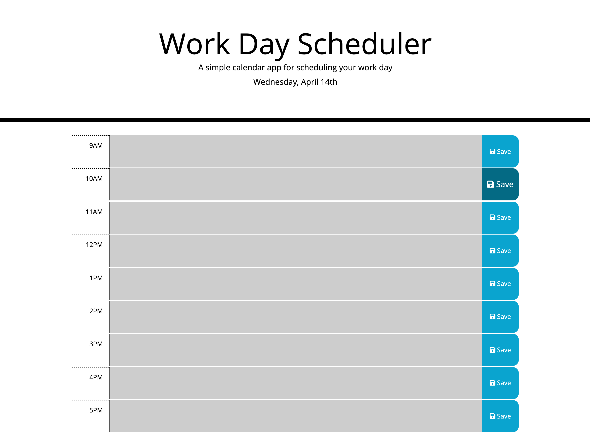

# work-day-scheduler

This is a calendar application that allows a user to save events for each hour of the day and features dynamically updated HTML and CSS powered by jQuery. 

Here is the link to the deployed application: [scheduler] (https://icvalle.github.io/work-day-scheduler/)

The following image shows the web application’s appearance.

